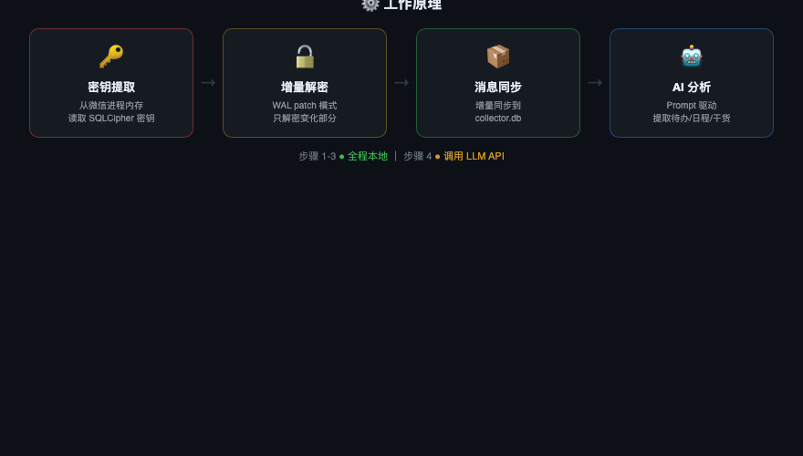

<p align="center">
  <b>Hermes Skill</b> — 微信 AI 个人助手，自动从微信聊天中提取待办、日程、干货、热点、技术讨论，推送到飞书。
  <br>macOS 14/15 + 微信 4.0+ + Python 3.9/3.13 验证通过
</p>

---

## 功能

6 个独立 cron 任务，全自动运行：

| 任务 | 频率 | 说明 |
|------|------|------|
| 待办扫描 | 每天 10:00 / 15:00 / 20:00 | 从私聊提取待办事项，按指纹去重，摘要式提醒（new/seen/due_soon/overdue/done） |
| 日程扫描 | 每 30 分钟 | 提取日程约定，状态追踪（pending → confirmed → expired） |
| 干货收集 | 每天 9:00 | 从群聊提取有价值内容，按天存档 |
| 热点扫描 | 每小时 | 跨群话题关联发现，今日累计模式（越晚越准） |
| 技术讨论 | 每天 10:30 | 提取技术讨论精华，按分类归档 |
| 偏好画像 | 每天 23:00 | 从用户自己发的消息中分析技术/商业/决策/写作偏好 |

另外还有 3 个低频洞察任务（热点日汇总 21:00、洞察分析 每3天、偏好扫描 每天）。

---

## 工作原理

<p align="center">
  
</p>

**两层设计**：

1. **CLI 层**（`scripts/`）：纯 Python，从微信本地加密数据库增量解密 → 提取结构化 JSON。不调 AI API。
2. **Agent 层**（`prompts/`）：Hermes cron 读 prompt 模板，调 CLI 拿 JSON，LLM 分析后推送到飞书。

想改分析逻辑？改 `prompts/*.md`，不用动代码。

---

## 数据流

```
微信进程 → 加密 DB + WAL（持续写入）
     ↓ refresh_decrypt.py（增量 WAL patch，~70ms）
解密后 DB
     ↓ collector.py --sync（增量同步）
collector.db
     ↓ extract_*.py（读 scan_state.json → 输出 JSON + 已有状态）
Hermes cron（LLM 分析 → 指纹去重 → 状态流转 → 摘要式推飞书 → 写 assistant.db）
```

---

## 快速开始

### 环境要求

- **macOS 13+**（ARM64 或 Intel）
- **微信桌面版 4.0+** 正在运行
- **Python 3.8+** + `pip3 install pycryptodome zstandard pyyaml`
- **[Hermes Agent](https://github.com/nousresearch/hermes)** 已安装并配置飞书

> 不需要 Hermes 也能运行本地数据提取。Hermes 只负责后续 LLM 分析、状态更新和飞书推送；如果只想定时解密、同步、提取 JSON，可以直接使用 `scripts/run_local.sh` + cron/launchd。

### 安装

```bash
# 1. 克隆到 Hermes skills 目录
git clone https://github.com/huangserva/wechat-assistant.git ~/.hermes/skills/social-media/wechat-assistant

# 2. 安装依赖
pip3 install pycryptodome zstandard pyyaml

# 3. 编译密钥提取工具
cd ~/.hermes/skills/social-media/wechat-assistant/scripts/decrypt
cc -O2 -o find_all_keys_macos find_all_keys_macos.c
```

### 设置

跟 Hermes 说 `帮我设置微信助手`，Agent 会自动引导：

1. 创建工作目录（建议 `~/wechat-assistant`）
2. 提取微信数据库密钥（需要 sudo）
3. 创建 config.yaml
4. 首次解密 + 同步
5. 配置飞书推送
6. 注册 cron 任务

全程跟着 Agent 走就行。

---

## 本机无 Hermes 运行

本仓库已补充一个本地 runner：`scripts/run_local.sh`。它会按顺序执行：

```
refresh_decrypt.py → collector.py --sync → extract_*.py → 写出 JSON 到 ~/wechat-assistant/out/
```

### 1. 安装依赖

```bash
cd ~/path/to/wechat-assistant
python3 -m pip install -r scripts/requirements.txt
```

### 2. 准备本机配置

本机配置文件放在：

```bash
~/wechat-assistant/config.yaml
```

当前已按本机活跃微信目录配置：

```yaml
wechat:
  db_dir: "~/Library/Containers/com.tencent.xinWeChat/Data/Documents/xwechat_files/wxid_your_account/db_storage"
  self_wxid: "wxid_your_account"
  decrypted_dir: "~/wechat-assistant/decrypted"
  collector_db: "~/wechat-assistant/collector.db"
  keys_file: "~/wechat-assistant/all_keys.json"
```

如果要换另一个微信账号，把 `db_dir` 改成对应的 `db_storage`，并更新 `self_wxid`。

### 3. 提取密钥

微信桌面版需要正在运行。密钥会写到 `~/wechat-assistant/all_keys.json`：

```bash
cd ~/wechat-assistant
sudo ~/path/to/wechat-assistant/scripts/decrypt/find_all_keys_macos
```

微信重启后密钥可能变化，需要重新执行这一步。

如果你在其他设备重新登录微信，本机桌面微信通常会下线；重新在本机登录后，本机微信会补同步最近聊天记录。数据库密钥只需要首次提取并保存到 `~/wechat-assistant/all_keys.json`，后续恢复直接复用这个文件。仓库提供恢复脚本：

```bash
~/path/to/wechat-assistant/scripts/recover_wechat_login.sh
```

恢复脚本会复用已保存密钥、全量刷新解密库，并默认同步最近 168 小时活跃会话。Hermes cron 前置的 `wechat_health_gate.py` 不会重新提取密钥；如果本机微信还没登录完成或 DB 仍在同步，它会跳过本轮，不再继续调用 LLM。等微信同步完成后，下一轮 cron 会用已保存密钥自动恢复。

### 4. 首次全量解密和同步

```bash
cd ~/path/to/wechat-assistant
python3 scripts/decrypt/decrypt_db.py --config ~/wechat-assistant/config.yaml
python3 scripts/collector.py --config ~/wechat-assistant/config.yaml --sync --recent-hours 0
```

首次同步后可以查看可配置的群：

```bash
sqlite3 ~/wechat-assistant/collector.db \
  "SELECT chatroom_id, chatroom_name FROM watched_chats WHERE chatroom_id LIKE '%@chatroom' LIMIT 30"
```

把需要做干货扫描的群填到 `~/wechat-assistant/config.yaml` 的 `monitor.groups`。

### 5. 手动运行

```bash
# 只刷新解密库并同步 collector.db
scripts/run_local.sh sync

# 同步后提取 JSON，输出到 ~/wechat-assistant/out/
scripts/run_local.sh todos
scripts/run_local.sh calendar
scripts/run_local.sh trending
scripts/run_local.sh digest
scripts/run_local.sh tech
scripts/run_local.sh preference

# 手动同步 scan_state.json 里的待办和 macOS 提醒事项
scripts/run_local.sh reminders
```

也可以临时指定配置：

```bash
WECHAT_ASSISTANT_CONFIG=/path/to/config.yaml scripts/run_local.sh trending
```

### macOS 提醒事项同步

如果希望微信待办同步到 macOS「提醒事项」，在 `~/wechat-assistant/config.yaml` 增加：

```yaml
reminders:
  enabled: true
  list_name: "WeChat Assistant"
```

开启后，`scripts/run_local.sh todos` 和 `scripts/run_local.sh all` 会在提取待办前同步一次 Reminders：提醒事项里被勾选完成的条目会回写为本地 todo 的 `done`，本地未完成 todo 会创建或更新到指定提醒事项列表。首次运行时 macOS 可能会弹出自动化授权提示。

### 6. 定时运行

仓库提供了 cron 示例：

```bash
crontab ~/path/to/wechat-assistant/scripts/crontab.example
```

日志会写到 `~/wechat-assistant/logs/`，提取结果会写到 `~/wechat-assistant/out/`。如果更偏好 macOS `launchd`，也可以让 launchd 调用同一个 `scripts/run_local.sh <command>`。

---

## 热点提取机制

`extract_trending.py` 经过三层处理，避免泛化大类词（如 "Claude"、"AI"）淹没具体话题：

1. **Token + Bigram 提取**：提取单词和相邻词组合（如 `claude mythos`、`plus 代充`）
2. **泛化词过滤**：25+ 个大类词（claude/gpt/ai/cursor 等）作为单 token 被过滤，但 bigram 形式保留（`claude mythos` 不被过滤）
3. **LLM 话题归纳**：prompt 指示 LLM 把相关 keyword 归纳为具体事件标题，跨群门槛 3+

---

## 文件结构

```
scripts/
  decrypt/
    find_all_keys_macos.c     — 从微信进程内存提取密钥（C，需 sudo）
    decrypt_db.py              — 全量解密（首次用）
    config.py                  — YAML 配置加载
  state_manager.py             — 统一状态管理（scan_state.json 读写）
  db_writer.py                 — assistant.db 写入工具（9 张表）
  refresh_decrypt.py           — 增量解密（WAL patch，cron 用这个）
  collector.py                 — 消息同步到 collector.db
  extract_todos.py             — 私聊待办 → JSON
  extract_calendar.py          — 日程 → JSON
  extract_digest.py            — 群聊干货 → JSON
  extract_trending.py          — 跨群热点 → JSON
  extract_tech.py              — 技术讨论 → JSON
  extract_preferences.py       — 用户偏好/写作样本 → JSON
  insight.py                   — 多天 digest 合并分析
  requirements.txt
prompts/
  todo-scan.md                 — 待办扫描 prompt
  calendar-scan.md             — 日程扫描 prompt
  digest.md                    — 干货收集 prompt
  trending-scan.md             — 热点扫描 prompt（每小时）
  trending-daily.md            — 热点日汇总 prompt
  tech-scan.md                 — 技术讨论 prompt
  insight.md                   — 洞察分析 prompt
  preference-scan.md           — 偏好画像 prompt
config.example.yaml
SKILL.md                       — Agent 读这个
```

---

## 隐私

数据提取（解密、同步、JSON 输出）全程本地运行。AI 分析阶段，提取后的聊天摘要会发送到你配置的大模型 API。原始加密数据库不会离开本机。

---

## 致谢

核心解密逻辑基于 [bbingz/wechat-decrypt](https://github.com/bbingz/wechat-decrypt/tree/feat/macos-support)（进程内存密钥提取、SQLCipher 4 解密、WAL 增量 patch）。

## License

MIT
